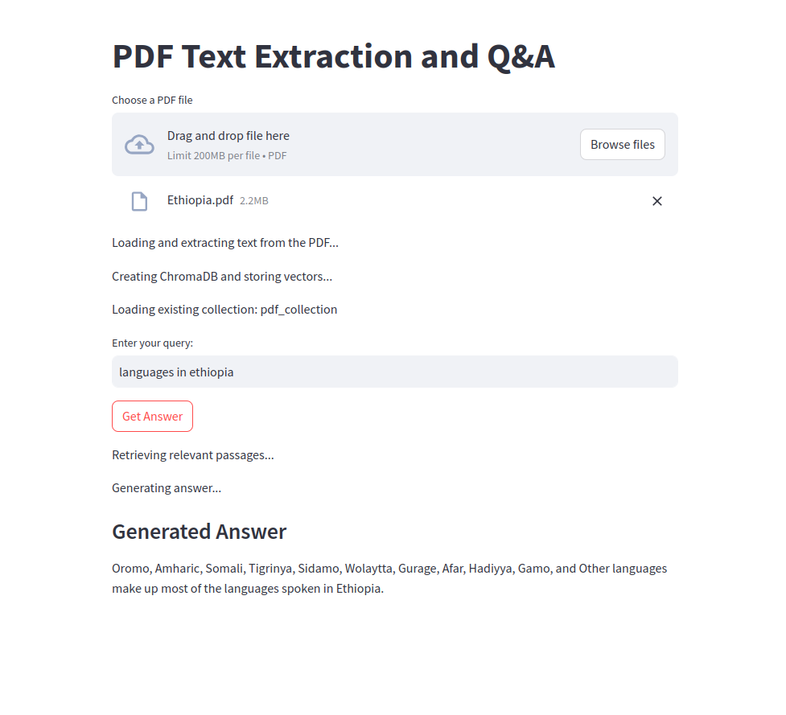

# Advanced Document Retrieval System

This project demonstrates an advanced document retrieval system using several key technologies, including `chromaDB` for vector database storage, `UMAP` for dimensionality reduction and visualization, `SentenceTransformers` for embeddings, and `Google Gemini AI` for query expansion and re-ranking of results. The project is built using Streamlit for the user interface.

## Table of Contents
1. [Features](#features)
2. [Installation](#installation)
3. [Usage](#usage)
4. [Key Components](#key-components)
5. [Streamlit Interface](#streamlit-interface)


## Features

- **PDF Reading & Chunking:** Reads PDF files, processes text into chunks using `RecursiveCharacterTextSplitter` and `SentenceTransformersTokenTextSplitter`.
- **Embedding and Storage:** Embeds text using `SentenceTransformer` and stores it in `chromaDB`.
- **UMAP Visualization:** Projects embeddings and queries into 2D space using UMAP for visualization.
- **Query Expansion:** Utilizes Google Gemini AI to generate hypothetical answers and multi-query expansion for more effective information retrieval.
- **Cross-Encoder Re-ranking:** Re-ranks results based on semantic similarity using `sentence-transformers CrossEncoder`.

## Installation

1. **Clone the Repository**
    ```bash
    git clone https://github.com/IbnuEyni/advanced-rag.git
    cd advanced-rag
    ```

2. **Install the required packages**  
    Use the `requirements.txt` file to install dependencies:
    ```bash
    pip install -r requirements.txt
    ```

3. **Install Streamlit**
    ```bash
    pip install streamlit
    ```

4. **Set up Google Gemini API key**  
    Add your `GEMINI_API_KEY` to a `secrets.toml` file in your Streamlit directory.

    ```toml
    [general]
    GEMINI_API_KEY = "your-google-gemini-api-key"
    ```

## Usage

To run the Streamlit app:

```bash
streamlit run app.py

```

## Demo



## Key Components
1. **PDF Reading and Chunking**

    RecursiveCharacterTextSplitter and SentenceTransformersTokenTextSplitter are used to split the text into chunks for embedding and storage.

2. **chromaDB Integration**

    Documents are embedded and stored in chromaDB to facilitate retrieval based on semantic similarity.

3. **UMAP for Embedding Visualization**

    UMAP reduces high-dimensional embeddings to 2D for visualization. Queries are also projected into the same space for comparison with document embeddings.

4. **Google Gemini AI for Query Expansion**

    Using the gemini-pro model, we generate hypothetical answers to the query and perform query expansion to retrieve more relevant results.

5. **Cross-Encoder Re-ranking**

    A CrossEncoder model from sentence-transformers is used to re-rank retrieved documents, improving the quality of search results.

## Streamlit Interface

The app interface allows users to:

- **Upload PDFs**: Upload a document to start the retrieval process.
- **Visualize Embeddings**: View embeddings in 2D space using UMAP.
- **Submit Queries**: Ask questions about the uploaded document.
- **Query Expansion**: Augment queries to improve retrieval.
- **Re-Ranking**: Re-rank results for improved relevance.