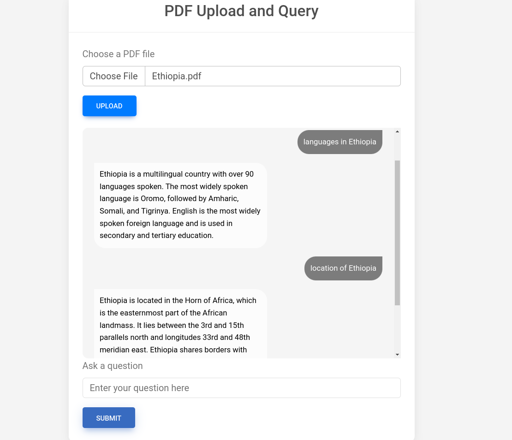

# Django Document Processing and Chat Applications

## Overview

This project contains two Django-based applications for document processing and query handling. Both applications allow users to upload documents and submit queries, but they differ in their approach to implementing Retrieval-Augmented Generation (RAG):

1. **LangChain-Based Application**:
   - Uses LangChain for document processing and RAG implementation.
   - Supports PDF, TXT, and DOCX file uploads.
   - Utilizes LangChain's document loaders, text splitters, embeddings, and chains for processing and querying documents.

2. **Custom RAG Application**:
   - Implements a custom RAG solution without using LangChain.
   - Supports PDF file uploads.
   - Uses PyPDF for text extraction and Chroma for document storage and retrieval.
   - Integrates Google Generative AI for response generation.

## Demo




## Setup and Installation

### Prerequisites

- Python 3.8 or higher
- Django 4.0 or higher
- Virtual environment (recommended)

### Setting Up the Virtual Environment

1. **Create a virtual environment**:

    ```bash
    python -m venv venv
    ```

2. **Activate the virtual environment**:

    - On Windows:

      ```bash
      venv\Scripts\activate
      ```

    - On macOS/Linux:

      ```bash
      source venv/bin/activate
      ```

### Install Dependencies

1. **Install required Python packages** for both applications:

    ```bash
    pip install django python-dotenv langchain_community langchain_google_genai langchain_chroma pypdf chromadb google-generativeai
    ```

2. **Create a `.env` file in the root directory**:

    ```plaintext
    GEMINI_API_KEY=your_google_api_key_here
    ```

    Replace `your_google_api_key_here` with your actual Google API key.

### Project Configuration

1. **Update Django settings**:

   Ensure `settings.py` includes the following:

    ```python
    import os

    # Load environment variables from .env file
    from dotenv import load_dotenv
    load_dotenv()

    # Your other settings here...

    GEMINI_API_KEY = os.getenv('GEMINI_API_KEY')
    ```

2. **Ensure MEDIA_ROOT is set correctly in `settings.py`**:

    ```python
    MEDIA_ROOT = os.path.join(BASE_DIR, 'media')
    ```

## How It Works

### LangChain-Based Application

1. **Document Upload and Processing**:
   - Users upload PDF, TXT, or DOCX files via the `/upload` endpoint.
   - The application uses LangChain’s `PyPDFLoader`, `RecursiveCharacterTextSplitter`, and `Chroma` for document processing.
   - Documents are split into chunks and embedded using Google Generative AI.

2. **Query Handling**:
   - Users submit queries via the `/chat` endpoint.
   - LangChain’s retrieval and generation chains are used to process queries and generate responses.

### Custom RAG Application

1. **Document Upload and Processing**:
   - Users upload PDF files via the `/upload` endpoint.
   - The application extracts text from PDFs using `PyPDF` and splits it into chunks.
   - Documents are stored and indexed using Chroma with a custom embedding function for Google Generative AI.

2. **Query Handling**:
   - Users submit queries via the `/chat` endpoint.
   - The application retrieves relevant text passages from Chroma and generates responses using Google Generative AI.

## Running the Application

1. **Apply migrations**:

    ```bash
    python manage.py migrate
    ```

2. **Run the development server**:

    ```bash
    python manage.py runserver
    ```

3. **Access the application**:

    - Open your web browser and navigate to `http://127.0.0.1:8000/`.

## Endpoints

- **Upload Document**:
  - URL: `/upload`
  - Method: POST
  - Form Data:
    - `pdf` (for the Custom RAG Application only)
    - `txt` (for the LangChain-Based Application)
    - `doc` or `docx` (for the LangChain-Based Application)
    - `query` (optional)

- **Submit Query**:
  - URL: `/chat`
  - Method: POST
  - Form Data:
    - `query` (required)

## Contributing

Feel free to submit issues and pull requests. Contributions to improve functionality, performance, and documentation are welcome.

## License

This project is licensed under the MIT License. See the [LICENSE](LICENSE) file for details.
