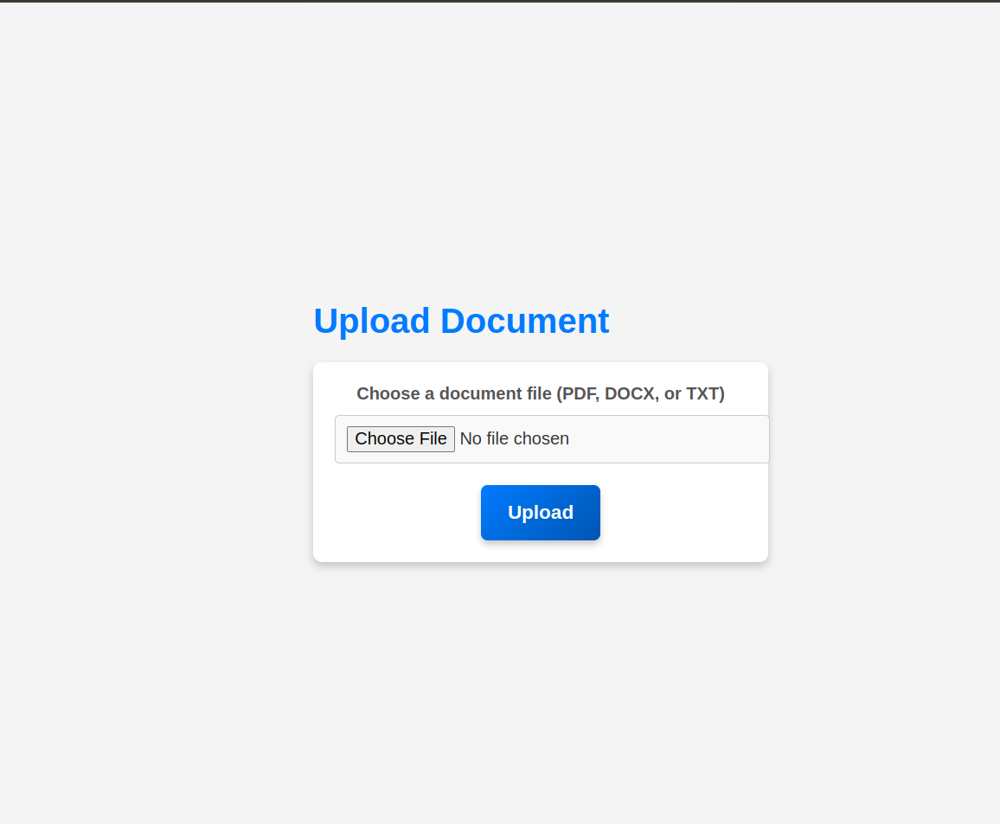

# 1. django_search_engine

A simple search engine application built with Django that allows users to upload documents, process them, and query for similar documents based on their content.
Features

    Upload and store PDF, DOCX, and TXT documents.
    Preprocess and clean document content.
    Search for documents using a query and retrieve the most similar documents based on content.
    View and delete uploaded documents.


## Demo 
Below is a screenshot of the application in action:

<div style="display: flex; justify-content: space-between; margin-top: 10px;">
    
    
</div>
<div style="display: flex; justify-content: space-between;">
    
    
</div>

# Prerequisites

    Python 3.8+
    Django 4.0+
    nltk
    scikit-learn
    pandas
    PyPDF2
    python-docx

# Installation

## Clone the repository:

    git clone https://github.com/yourusername/django-search-engine-app.git
    cd django-search-engine-app

## Create a virtual environment and activate it:

    python -m venv env
    source env/bin/activate  # On Windows use: env\Scripts\activate

## Install the required packages:

    pip install -r requirements.txt

## Download NLTK data:

In the Django shell, run:

    import nltk
    nltk.download('stopwords')
    nltk.download('wordnet')
    nltk.download('punkt')

## Apply database migrations:

    python manage.py migrate

## Create a superuser (optional):

    python manage.py createsuperuser

## Run the development server:

    python manage.py runserver

## Access the app:

    Open a web browser and go to http://127.0.0.1:8000/.

# Usage
## Upload Documents

    Navigate to the upload page at http://127.0.0.1:8000/upload/.
    Select and upload a document (PDF, DOCX, or TXT).

## Query Documents

    Navigate to the query page at http://127.0.0.1:8000/query/.
    Enter a search query and submit to find similar documents.

## View and Delete Documents

    Navigate to the document list page at http://127.0.0.1:8000/documents/ to view all uploaded documents.
    To delete a document, click on the delete option next to the document.

## File Overview

Contains the core functionality for uploading, processing, querying, and deleting documents:

- **preprocess_data**: Cleans and preprocesses document text.
- **upload_document_page**: Renders the upload document page.
- **upload_and_process_documents**: Handles document upload and processing.
- **query_page**: Renders the query page.
- **process_query**: Processes the search query and returns similar documents.
- **get_similar_articles**: Calculates and returns similar documents based on the query.
- **extract_text_from_pdf**: Extracts text from PDF files.
- **extract_text_from_docx**: Extracts text from DOCX files.
- **extract_text_from_txt**: Extracts text from TXT files.
- **delete_document**: Deletes a document from the database.
- **document_list**: Displays a list of all documents.


# 2. Flask Web Crawler

## Overview
The **Product Similarity Finder** is a Python-based web application designed to scrape e-commerce sites for product data and help users find similar products based on a target product's name and price. The project leverages web scraping techniques, natural language processing, and a Flask-powered frontend for an interactive user experience.

## Features
- **Web Scraping**: Gathers product information from e-commerce sites using `requests` and `BeautifulSoup`.
- **Name Preprocessing**: Cleans and standardizes product names using `nltk` tools.
- **Price Extraction**: Extracts numeric values from price strings and handles data gracefully.
- **Similarity Calculation**: Uses `SequenceMatcher` to evaluate name similarity and calculates price deviation for product ranking.
- **Frontend Interface**: User-friendly web interface for inputting product details and displaying results.
- **Caching**: Saves and loads product data to/from JSON and CSV files for efficient data retrieval.

## Technologies Used
- **Backend**: Python, Flask
- **Web Scraping**: `requests`, `BeautifulSoup`
- **Data Processing**: `nltk`, `csv`, `json`, `collections`
- **Frontend**: HTML, CSS
- **Styling**: Custom CSS for an appealing UI

## Installation

### Prerequisites
- Python 3.x
- `pip` (Python package manager)

### Steps to Install
1. **Clone the repository:**
2. **Install the required Python packages:**
3. **Download NLTK data:**
    ```bash
    import nltk
    nltk.download('stopwords')
    nltk.download('punkt')
    ```
## Running the Application

1. **Start the Flask server:**

    python app.py

2. **Access the web app:** Open your web browser and go to http://127.0.0.1:5000/.

## Demo 

Below is a screenshot of the application in action:

<div style="display: flex; justify-content: space-between;">
    
    
</div>

## Usage Guide

1. ### Enter Details:
    Provide the target product name and price.
    Specify how many similar products to retrieve.

2.  ### Submit Form:
    Click on the "Find Similar Products" button.

3. ### View Results:
    The page will display a list of similar products ranked by their overall similarity score.

## Contributing

Feel free to fork this repository and submit pull requests with improvements or fixes. Please ensure that you follow the existing code style and write tests for any new features.